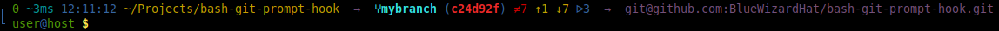
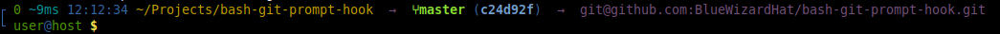
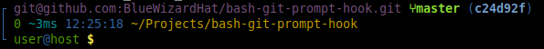

Git/Bash helpers
==============================================================================

#### Installation

To install, clone this repo and run the `install-prompt.sh` script.

This installs a function to the Bash prompt that displays Git info whenever
the current directory is under a git repository.

To additionally install some helpful Git aliases, run the `install-git-aliases.sh`
script.

#### General info

This was developed using git version 1.8.1.2 and should work with this version
of git and newer. It may or may not work with some older versions. It has been
tested with multiple versions of Git up to 2.27.0.

The info line is able to show the following information
- upstream origin
- branch or tag, including if the branch is local (⑃) or tracking a remote (⑂)
  and weather a tag is annotated (✔) or not (✘)
- if branch is tracking a remote with a different name than itself the
  tracked remote branch (upstream branch) (←)
- special states like merging, rebasing, cherry picking and bisecting
- current hash
- number of files that are changed from last commit if any (≠)
- how many commits the branch is ahead (↑) and/or behind (↓)
- number of stashes if any (ᐅ)

A examples of a line:

```
| myorigin ⑂mybranch (hash) ≠7 ↑1 ↓2 ᐅ3 |
```


#### Config

The git prompt can be configured slightly with some environment variables
- GIT_PROMPT_SHOW_SHA=true
- GIT_PROMPT_SHOW_STASHES=true
- GIT_PROMPT_SHOW_TRACKING=true
- GIT_PROMPT_DISABLE_UTF8_MARKERS=false

An example of a line with utf8 markers disabled:
```
| myorigin mybranch (hash) M:7 [ahead 1, behind 2] stashes:3 |
```


#### Additinal configuration options

Additionally the git prompt also takes two special configs that are used by the smart
prompt explained below.

- GIT_PROMPT_RIGHT_LENGTH=&lt;number&gt;
	tells the prompt to try to fit the git information into the number of characters and put the
	result into a variable ```git_prompt_right```.

- GIT_PROMPT_DISABLE_PRINT=(true,false)
	tells the prompt to never actually print a line. Instead put the information into either
	```git_prompt_right``` or ```git_prompt_line``` depending on weather GIT_PROMPT_RIGHT_LENGTH
	is set and the information can fit.

Unless you are making your own smart prompt you won't need to worry about these.


## Smart prompt

Also included here is a setup of the bash prompt where the git line is integrated
rather than a separate line. I call this my smart prompt since it integrates a lot
of handy features besides git.

Smart prompt is a two line prompt because I hate having the current directory push
the start of the command line towards the right edge of the terminal, I like to start
typing my commands near the start of the line.

This prompt shows the directory, git and other information on one line and has the
username@hostname and actual prompt on a separate line. Git information is shown last
with the origin moved to the right.

The smart prompt shows the following information:

Line 1:
- exit code of the last command (in green for zero, in red for non-zero)
- how long the last command took to execute
- number of background jobs (hidden if none)
- the current time (24h)
- directory
- git information if in a git repository

Line 2:
- username
- hostname
- prompt ($ for non-root, and # for root)


Example of inline mode:
```
┌ 0 ~5ms 08:44:16 ~/directory/  →  ⑂mybranch (hash) ≠7 ↑1 ↓2 ᐅ3  →  myorigin
└ user@host $
```



It can also be used in three-line mode (GIT_PROMPT_INLINE=false):
```
┌ myorigin ⑂mybranch (hash) ≠7 ↑1 ↓2 ᐅ3
│ 0 ~5ms 08:44:16 ~/directory/
└ user@host $
```


Which of course again becomes a two line prompt when not in a git directory.

#### Config

The git prompt can be configured slightly with some environment variables
- GIT_PROMPT_SHOW_ORIGIN=true
	(only relevant in inline mode, when showing git information on a separate line origin is always shown)
- GIT_PROMPT_INLINE=true
	allows you to disable inline mode so git info is always a separate line.


#### Dropping git information intelligently (inline mode)

I usually use the excellent [Guake Terminal](http://guake-project.org/) so my terminal
is pretty wide and thus has plenty of room for information, however sometimes even I
have to go into a deep deep directory structure.

So in smart mode the git functionality will automatically try to fit on the line
by shortening the origin and dropping the least useful information a little at a time
from the prompt if there is not enough space. In case there is not enough space on
the line for even the most basic git information it will even revert back to the
default mode of printing git info on a separate line.
